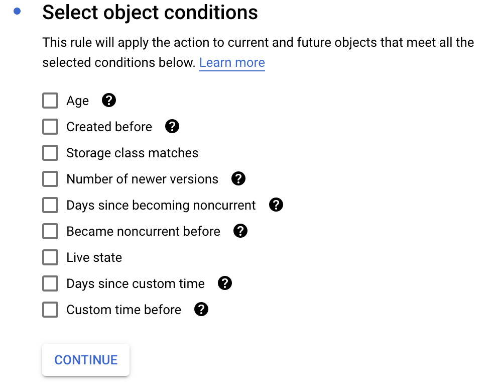

# Managing Storage and Databases

## Preserving Objects in Cloud Storage

- Binary Large Object (BLOB) storage
- Images, videos, audio files, documents, static websites etc
    - best practice for static websites: use domain for website as bucket name
- Automatic data encryption at rest and decryption on delivery
    - Can specify own key from GCKMS otherwise Google managed key will be used
- Primary container: buckets
- Project-based
- Globally unique ID
- Specific location
- Set class for optimum price and performance
    - Location Type
        - Multi-regional - highest availability, most frequently accessed
        - Dual Region - HA and low latency across 2 regions
        - Regional - routinely accessed, best for analytics. Also used for machine learning
    - Storage Type
        - Standard - Best for short-term storage and frequently accessed data
        - Nearline - infrequently accessed (less than once a month), data backup
        - Coldline - least accessed (less than once a quarter), lowest cost, typically for disaster recovery
        - Archive - Best for long-term digital preservation of data accessed less than once a year

gsutil is the cli for google cloud storage

Address gs://$BUCKET_NAME

### Setting Storage Lifecycle Rules

You’ll need to accomplish the following steps to complete your task:
1. Create a Cloud Storage bucket.
2. Establish lifecycle rules in the console.

- After 180 days, set to Nearline.
- After 365 days, set to Coldline.
1. From command line, get lifecycle rules.
2. Set lifecycle rule from command line using JSON file.

Get lifecycle rule for bucket

`gsutil lifecycle get gs://[BUCKETNAME]`

Set lifecycle rule on command line with JSON file

`gsutil lifecycle set $JSON_FILE_NAME.json gs://[BUCKET_NAME]`

## Non-Relational Data Management with Cloud Datastore

- NoSQL document database for semi-structured data
- Key features
    - ACID transactions
    - Highly Available and scalable
    - Multiple access options
        - Console
        - JSON API
        - Open source clients
    - SQL-like language GQL
- Structure - similar to traditional but more flexible (schemaless):
    - Kinds - like tables
    - Entity - like row but can have different properties
    - Property - like field but can have multiple values
    - Key - like primary index
    - Supports optional ancestors and children
- Uses: product catalogs, user profiles, ACID transactions, etc.
- Unit Size: 1mb entity
- Terrabytes of capacity

Composite index can be used for more complex filtering

### GQL

`SELECT * FROM Album WHERE artist = "The Beatles"`

## Handling Relational Data via Cloud SQL

- Fully managed relational database service
- Supports Postgresql 9.6
- Supports MySQL 5.5 (1st generation) and 5.6 or 5.7 (2nd generation)
- Robust scalability
- Automatic replication and backup
- Highly configurable SQL instances
- Data automatically encrypted
- Default firewalls for each instance
- Full integration with Google Cloud Services
- Terrabytes of capacity
- Unit size determined by DB engine

### Setting up an SQL instance

- Choose a database engine and generation (2nd generation is recommended)
- Name the instance
- set a password for the root user
- Set location and zone
- Configure machine type and storage
    - Choice between SSD and HDD drives
    - Cannot decrease capacity when set. Can scale up storage as needed

## NoSQL Management with Cloud BigTable

Designed to handle big data simply

- Fully managed, massively scalable NoSQL database service for big data
- Used for Gmail, Google Search, Maps & Analytics as well as eBay and Spotify
- although also NoSQL, different from Cloud Datastore
    - Wide column database vs document database
    - No SQL-like language available
    - Single key per row
- Capable of holding hundreds of petabytes of information
- Columns wide enough for entire web pages or satellite imagery
- Consistent low latency and high throughput
- Dynamically change cluster size without stopping and restarting
- Use cases: graph data, financial data, IoT data, marketing data, etc
- Petabytes+ of capacity
- Unit sizes
    - ~10 MB cell
    - ~100 MB row

Can interact with BigTable with cloud shell `cbt` commands

- `sudo gcloud components install cbt`
- `echo project = $PROJECT_ID > ~/.cbt`
- `echo instance - $INSTANCE_ID >> ~./cbtrc`
- `cbt createtable $TABLE_NAME`
- `cbt ls` - to return tables
- `cbt createfamily $TABLE_NAME cf1` - to create column family in table
- `cbt set $TABLE_NAME $ROW_NAME $FAMILY:$COLUMN_QUALIFIER`
- `cbt read $TABLE_NAME`

## Exploring Additional Data Services

### Cloud Spanner

- Fully managed, enterprise grade, relational database service
- Is to Cloud SQL as BigTable is to Cloud Datastore
- Scales horizontally like NoSQL databases
- High Availability (99.999% uptime) with strong consistency
- Industry standard SQL support
- Supports Data Definition Language (DDL)
- Client libraries in many programming languages
- Full console support
- Use cases
    - Call centers
    - Financial trading
    - Telecom
    - Transportation
    - etc

### Cloud Memory Store

- Fully managed, in-memory datastore service
- Redis protocol compatible
- Extremely low latency: sub-millisecond
- As-needed scaling, up to 300GB instance
- Connect with App Engine, Compute Engine or Kubernetes Engine
- Service Tiers:
    - Basic - default, for basic caching
    - Standard - for highly available Redis intance
- Use cases: caching layer in gaming & analytical pipelines, stream processg