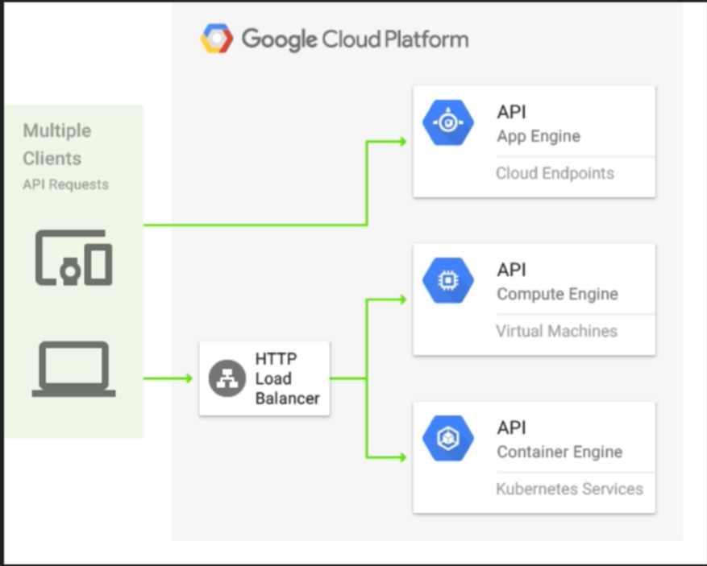
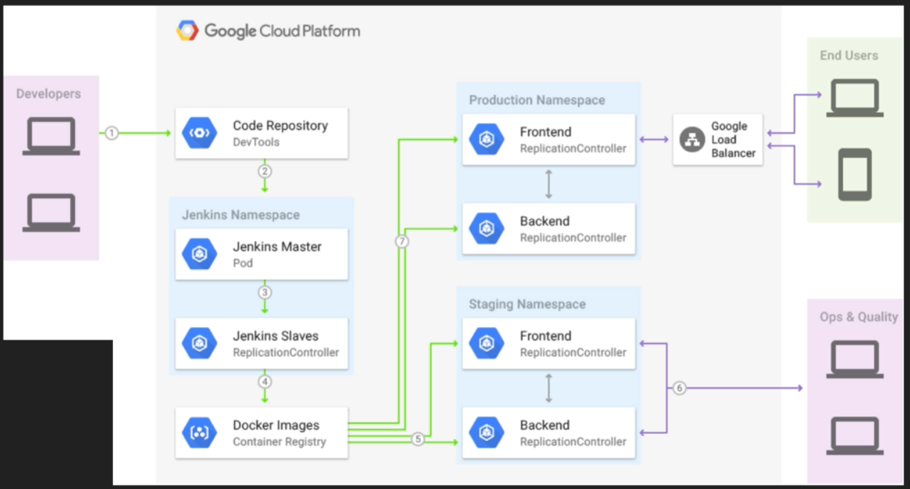
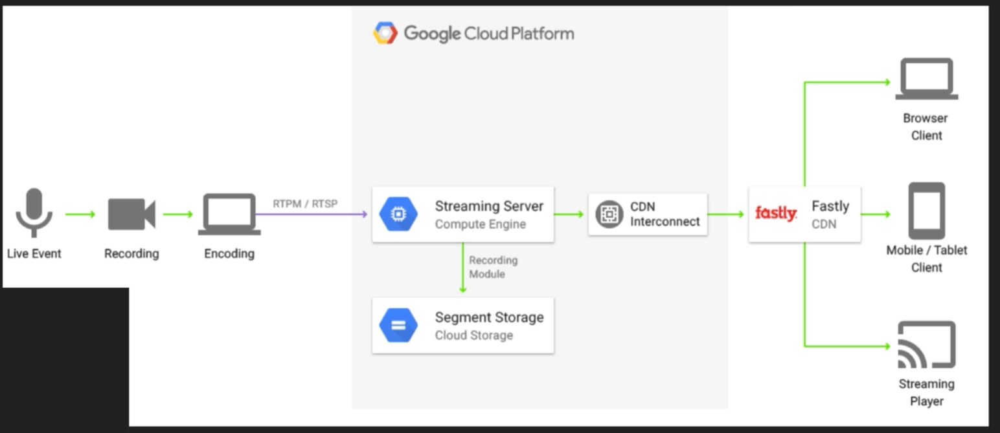
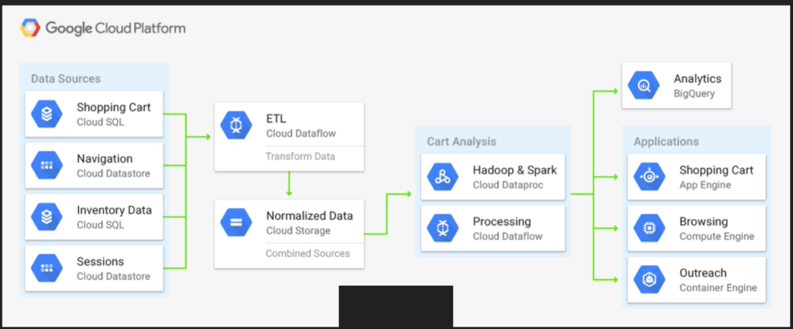

# System of Services

[Cloud Reference Architectures and Diagrams | Cloud Architecture Center](https://cloud.google.com/architecture)

## API Hosting

[API Gateway Architecture | API Gateway Documentation | Google Cloud](https://cloud.google.com/api-gateway/docs/architecture-overview)

## Jenkins on Kubernetes

[Jenkins on Kubernetes Engine | Cloud Architecture Center](https://cloud.google.com/architecture/jenkins-on-kubernetes-engine)

## Log Processing

[Processing logs at scale using Cloud Dataflow](https://cloud.google.com/architecture/processing-logs-at-scale-using-dataflow?hl=en)

## Live Streaming

[Streaming and live tailing log entries | Cloud Logging | Google Cloud](https://cloud.google.com/logging/docs/view/streaming-live-tailing?hl=en)

## Shopping Cart Analysis

[Deploying event-sourced systems with Cloud Spanner](https://cloud.google.com/architecture/deploying-event-sourced-systems-with-cloud-spanner)

